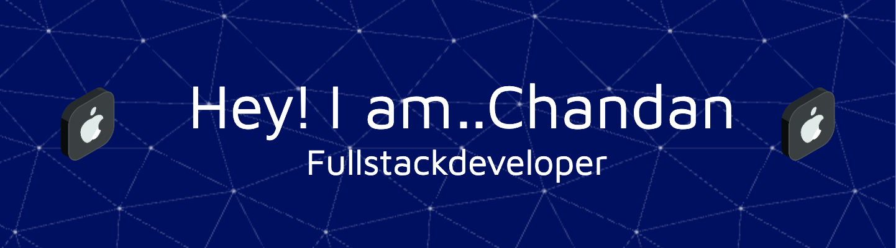

<h1 align="center">👋 Hi, I'm Chandan Kumar Raj</h1>

<p align="center">
  
</p>

---


### About Me
- 🌍 Based in *Kolkata, India*.
- 🎓 *Pre-Final Year* student at *Techno Main Saltlake, specializing in **CSE-DS*.
- 💼 *Core Member* at *NooBuild, **Student Director* at *Unstop, and **Contributor* to various open-source projects.
- 🌐 Experienced in *DevOps, **Cloud, **Backend Development, and **Data Science*.
- 🚀 Currently working as a *Student Ambassador* for *LetsUpgrade* and *Campus Ambassador* for *Zuno by foundit*.
- 📈 Contributing to *GDG Kolkata* and *GirlScript Summer of Code 2024*.

---

### 🛠️ Tech Stack
<p align="center">
  
</p>

---

### 🔥 GitHub Stats
<div align="center">
  
  
</div>

---

### 🌐 Connect with Me
<p align="center">
  <a href="https://www.linkedin.com/in/chandan-kumar-raj/" target="_blank"></a>
  <a href="https://github.com/chandan0629" target="_blank"></a>
  <a href="mailto:chandantoaws@gmail.com" target="_blank"></a>
</p>

---

### 🚀 Open Source Contributions
- 👨‍💻 Contributor at *GirlScript Summer of Code (GSSoC '24)*.
- 🛠️ Facilitator in the *Google Cloud Arcade Facilitator Program*.
- 🌱 Student Developer Program member at *GitHub*.

---

### 📊 Languages & Tools
```text
🌐 Languages: Python, Java, C++, JavaScript, TypeScript
🛠️ DevOps Tools: Docker, Kubernetes, Terraform, GitHub Actions
☁️ Cloud: AWS, GCP
📈 Data: Power BI, RDBMS, NoSQL, Big Data
