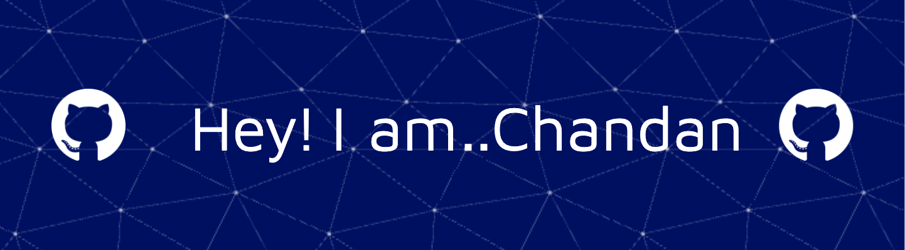

  

---

# 💫 About Me:
About Me 🌍 Based in Kolkata, India. 🎓 Final Year student at *Techno Main Saltlake, specializing in *CSE-DS. 💼 Core Member at *NooBuild, *Student Director at *Unstop, and *Contributor to various open-source projects. 🌐 Experienced in *DevOps, **Cloud, **Backend Development, and *Data Science. 🚀 Currently working as a Student Ambassador for LetsUpgrade and Campus Ambassador for Zuno by foundit. 📈 Contributing to GDG Kolkata and GirlScript Summer of Code 2024.

## 🌐 Socials:
    

# 💻 Tech Stack:
                                                 
# 📊 GitHub Stats:
 
 

## 🏆 GitHub Trophies

## 🏆Holopin Badges

### ✍️ Random Dev Quote

### 🔝 Top Contributed Repo

---

<!-- Proudly created with GPRM ( https://gprm.itsvg.in ) -->

